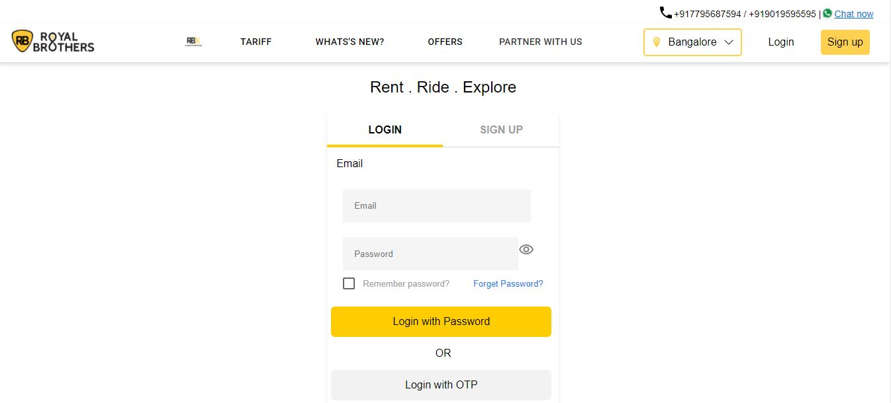
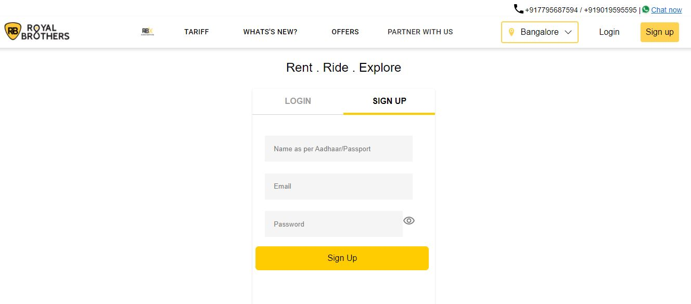
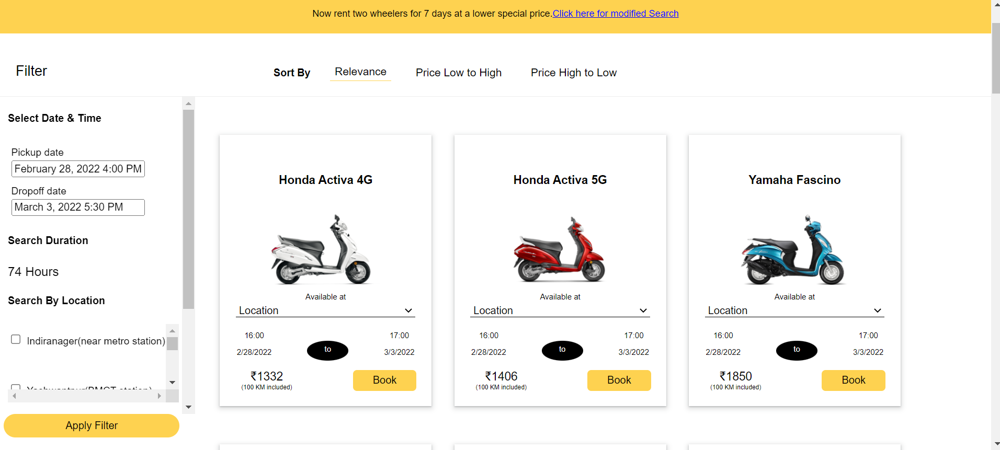
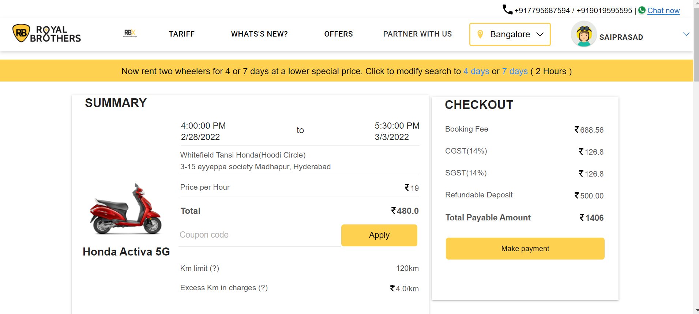
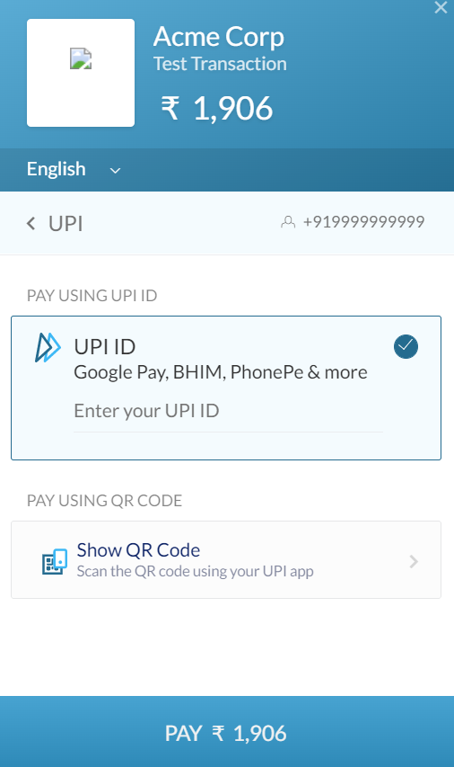

# Team RoyalBrothers

# 👋 Introduction
Royal Brothers provides bike rental services across Major Cities in India and started in 2015 with aim to focus on building India’s largest mobility solutions provider. Their focus has led us to build a platform providing rentals spanning across 14 states, 43 cities and 3 international cities.

-They are obsessed with the concept of ‘Why buy when you can rent’.
# 🙌 About this project:
This is a team Project, built by  Team of 5 members in Unit -5 construct Week at **Masai School** and  created the **RoyalBrothers Website** clone with in 7 days

# ❤️ Our Team 
- [Abhishek Kumar Mishra](https://github.com/abhimis12)
- [Dasari Rajnarayana](https://github.com/drajnarayana)
- [Sahil Kumar](https://github.com/sahilgarg29)
- [Saiprasad Khansole](https://github.com/sai12348765patil)
- [Yarasi Ashokvardhana Reddy](https://github.com/AshokvardhanaReddy)
# How To Use ✅
First we need to go [RoyalBrothers Website](https://www.royalbrothers.com/). Then you need to select city according to your need and if you have account with RoyalBrothers website, please login with your details. Otherwise please create a account by clicking on signUp Button and please provide  your details and  You'll get an OTP enter that OTP for validation and you'll be logged in. There you can explore the home page. In Home Page, pick your required date and it will redirect to the page which shows all bikes models which are availble.
choose the bike and pay the amount. Finally, you reserved your bike.
 In Tariff Page, you will find price for the different bike models and complete details. 
  
# Tech Stack Used 🔧
- `React` 
- `Redux`    
- `JavaScript`
- `Material UI` 
- `MongoDB` 
- `Node.JS`
-`Express JS`
- `Git`
- `HTML`      
- `CSS`   
# Home Page
In Home Page, you can book your bike ride by providing some details like your pickup date and dropoff date.
And you can also find some more details like when they highlighted in National News Papers and milestones which are achieved by **RoyalBrothers**.    
</img>  

# LOGIN & SIGN UP Page
If you have account with Royal Brothers, please click on **Login** Button on top right side of the home page to login into your account.

If you Don't have an account, please click on **SignUp** Button on top right side of the page to create account and provide required details and you will get OTP to mobile number to confirm signUp procedure.

Finally, login with your Details and you will redirected to HomePage.   

  

# Tariff Page
In Tariff Page, you will find all bikes which are provided by RoyalBrothers and the price details for each bike like how much they will charge, how mamy KMs to allowed to travel, how much money they will charge if you exceed the permissable KMs.
They also provide bikes on monthly basis, for 15, 7 days and Hourly.   

  

# Booking Details
In this page, you can find details like from where you need to pick your bike and you can also search bikes which are available based on location, you can also find based on bike models which you required.   
  

# Order Summary

After Selecting your bike, you will be redirected to this page where you can see details like bike you selected, total Price you need to pay to book your order, number of helmets you required, permissible KM , if you exceed the permissible KM, how much will they charge and Finally coupon Code Details.
If you have Coupon Code, please provide in Coupon Code Section to get Discount on your ride.   

&nbsp;

# Payment Page

In this page, you will need to pay the amount as per requirement and Finally You booked you ride With **RoyalBrothers**.
  

&nbsp;

# &nbsp; &nbsp; &nbsp; &nbsp; 👋 Thank You 👋
